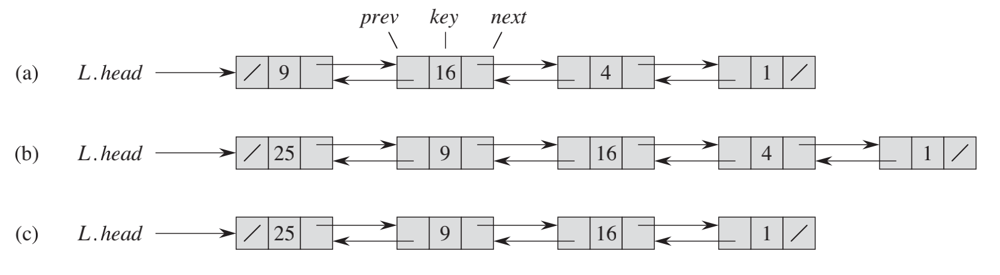
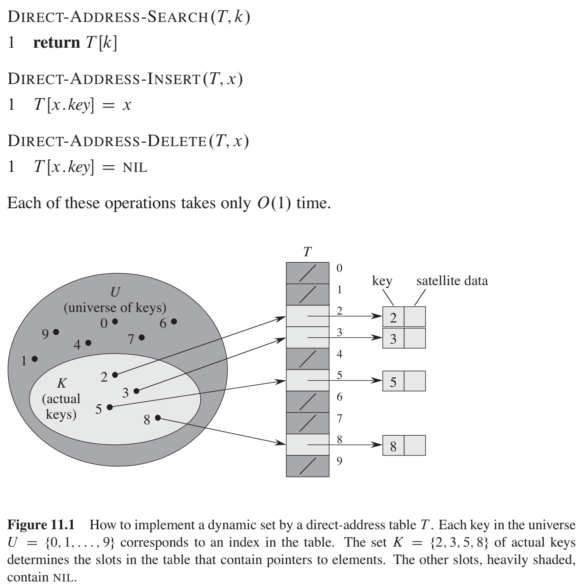
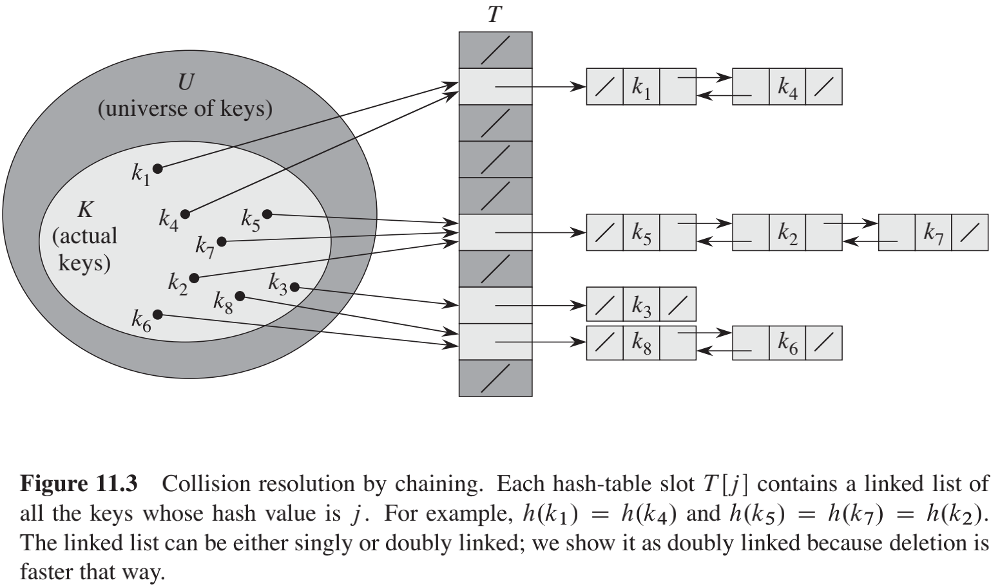

# 数据结构

Dynamic Set 的概念：可以增删改查

## 数据结构（一）

#### 栈/队列
**栈Stacks**
- LIFO, last in first out, 后进先出
- 方法
    - empty
    - push, pop: O(1)

**队列Queues**
- FIFO, first in first out, 先进先出
- 方法
    - enqueue: O(1)
    - dequeue: O(1)

#### Linked lists


- 方法
    - search
    - insert: O(1)
    - delete: O(1)


#### Hash Tables
- Direct-address tables


- Hash Tables
Use hash function, may cause a collisio.


**Collision resolution by chaining**

**Hash Function**
- Uniform hashing 
- The division method
```
h(k) = k mod m
```
- The multiplication method
```
h(k) = Math.floor(m*(kA mod 1))
// A = 0.6180339887
// kA mod 1 是指小数部分
```
- Universal Hashing
    - Select the hash function at random from a carefully designed class of functions
    - Design a universal class of hash functions
    ```
    h_{ab}(k) = ((ak+b)mod p) mod m
    ```
- Open addressing


- 


