# The Data Warehouse Toolkit

---

## Contents
1. [**Chapter 1: DW/BI & Dimentional Modeling**](#chapter1)
	1. [Goal of DW/BI](#goal)
	2. [DW/BI manager's responsibilities](#responsibility)
	3. [Dimentional Modeling Introduction](#dimension-intro)
	4. [Star Scheams vs. OLAP](#compare)
	5. [Kimball's DW/BI Architecture](#kimball)
	6. [Alternative DW/BI Architectures](#alternative)
2. Chapter 2: Kimball Dimensional Modeling Techniques Overview
3. Chapter 3: Retail Sales
4. Chapter 4: Inventory
5. Chapter 5: Procurement
6. Chapter 6: Order Management
7. Chapter 7: Accounting
8. Chapter 8: Customer Relationship Management
9. Chapter 9: Human Resources Management
10. Chapter 10: Financial Service
11. Chapter 11: Telecommunication
12. Chapter 12: Transportation
13. Chapter 13: Education
14. Chapter 14: Healthcare
15. Chapter 15: Electronic Commerce
16. [**Chapter 16: Insurance**](#chapter16)
17. [**Chapter 17: Kimball Lifecycle Overview**](#chapter17)
	1. [Roadmap](#roadmap)
	2. [Lifecycle Launch Activities](#launch)
	3. [Lifecycle Technology Track](#tech_track)
	4. [Lifecycle Data Track](#data_track)
	5. [Lifecycle BI Application Track](#bi_track)
	6. [Lifecycle Wrap-up Activities](#maintain)
18. [**Chapter 18: Dimensional Modeling Process and Tasks**](#chapter18)
	1. [Modeling Process Overview](#overview)
	2. [Get Organized](#organize)
	3. [Design the Dimensional Model](#design_dim_model)
19. [**Chapter 19: ETL Subsystems and Techniques**](#chapter19)
20. Chapter 20: ETL System Design and development Process and Task
21. Chapter 21: Big Data Analytics


---


## Chapter 1: Data Warehousing Business Intelligence and Dimensional Modeling Prier <a name="chapter1"></a>

**Operational system**: where you put the data in <br/>
**DW/BI system**: where you get the data out

### Goals of DW/BI <a name="goal"></a>

- Make info easily accessible: understandable, simple and fast
- Present info consistently
- DW/BI must adapt to change: existing data shouldn't change when new data added
- Present info in a timely way
- Deliver data when there is little time to clean or validate it
- DW/BI system must serve as the authoritative and trustworthy foundation for improved decision making
- The business community ust accept the DW/BI system to deem it successful

### DW/BI manager's responsibilities <a name="responsibility"></a>
- Understand the business users
- Deliver high-quality, relevant, and accessible information and analytics to the business users
- Sustain the DW/BI environment


### Dimentional Modeling Introduction <a name="dimension-intro"></a>
**Address two requirements:**
- Deliver data that is understandable to the business users
- Deliver fast query performance
> - "Make everything as simple as possible, but not simpler." Albert Einstein
> - 3NF: too complicated for BI queries. Users can't understand, navigate, or remember normalized models.
> - Dimensional model: address the problem of overly complex schemas in the presentation area.

### Star Scheams vs. OLAP (online analytical processing) Cubes <a name="compare"></a>

**Star shemas**
- Dimention table: "who, what, where, whhen, how, why" (usually no more than 50 attributes)
- Fact table: measurements
- Dimensions provide the entry points to the data, and the final labels and groupings on all DW/BI analysis
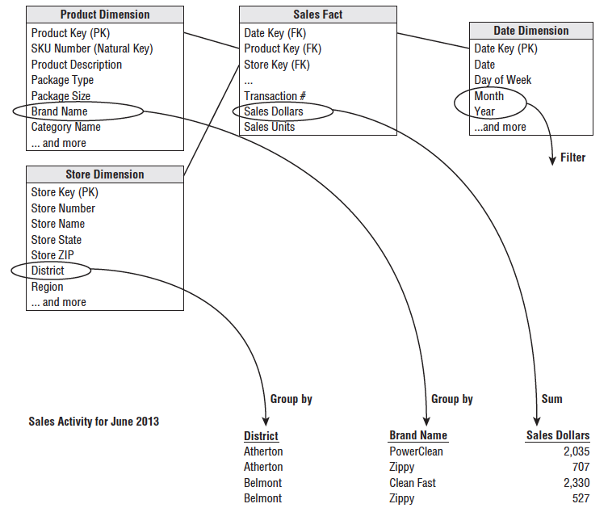

```sql
SELECT
	store.district_name,
	product.brand,
	SUM(sales_facts.sales_dollars) AS sales_dollars
FROM
	store,
	product,
	date,
	sales_facts
WHERE
	date.month_name = 'January' AND
	date.year = 2013 AND 
	store.store_key = sales_facts.store_key AND 
	product.product_key = sales_facts.product_key AND
	date.date_key = sales_fatcs.date_key
GROUP BY
	store.district_name
	product.brand
```

**OLAP**
- Data is stored and indexed using format and techniques that are designed for dimensional data
- Create performance aggregations or precalculated summary tables
- Cubes deliver suoerior query performance (b/c precalculations, indexing strategies)
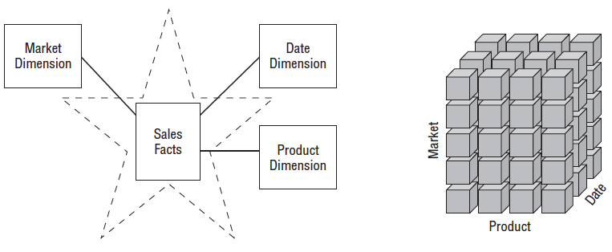

### Kimball's DW/BI Architecture <a name="kimball"></a>
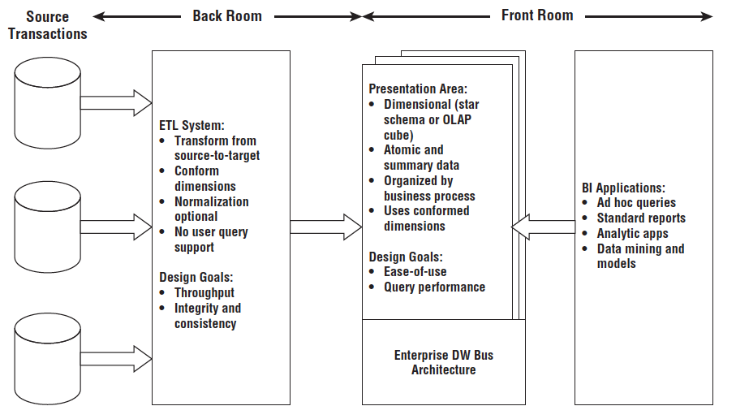

**ETL**
- Understand the source data
- Copy the data into ETL system
- Other potential transformations: cleanse the data, combine data from multiple sources, de-duplicate data
- Load data into the presentation area's target dimensional models

**Presentation Area (Support Business Intelligence)**
- Data should be presented, stored, and accessed in dimentional shcemas 
- The presentation area should include detailed, atomic data (for unpredictable ad hoc user queries)
- The presentation data area should be structured around business process measurement events
- All the dimensional structures must be built using common, conformed dimensions

**Business Intelligence Applications**
- All BI applications query the data in presentation are
- Such as modeling or forecasting tools


### Alternative DW/BI Architectures <a name="alternative"></a>

**Independent Data Mart Architecture**
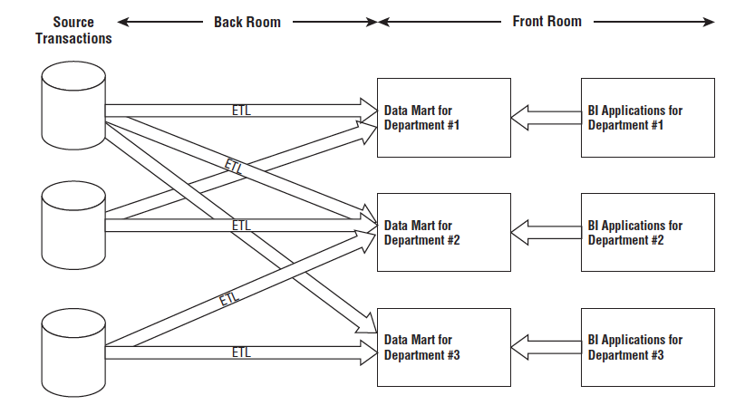
- A database satisfies department's analytic requirements
- Other department don't have access
- Prevalent in large organizations
- Drawbacks: multiple uncoordinated extracts from the same operational sources, redundant storage of data
> (Difference) Dimensional Modeling: atomic details, built by business process

**Hub-and-Spoke Corporate Information Factory Inmon Architecture (CIF)**
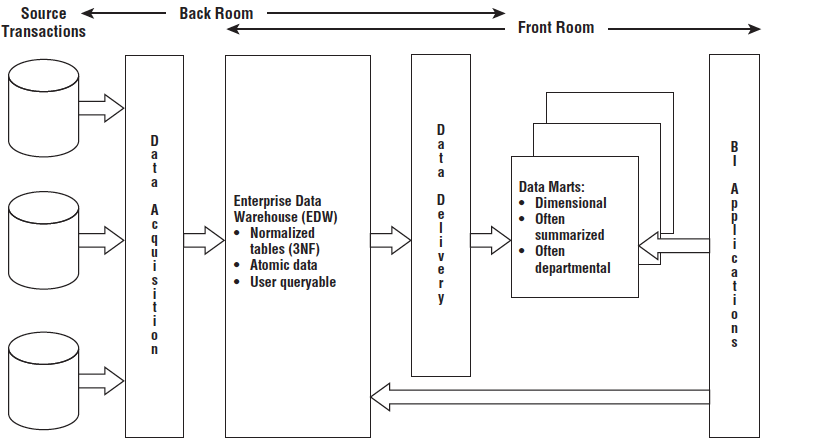
- Normalized EDW (Enterprise Data Warehouse)
- Advocate enterprise data coordination and integration

**Hybrid Hub-and-Spoke and Kimball Architecture**
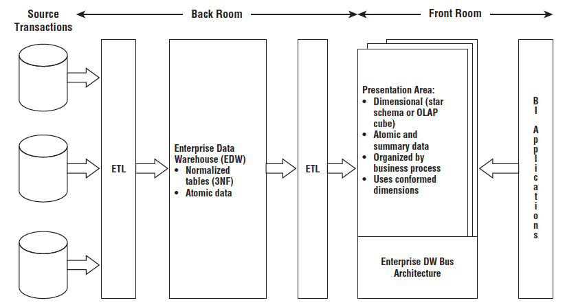


---

## Chater 16: Insurance <a name="chapter16"></a>


## Chapter 17: Kimball Lifecycle Overview <a name="chapter17"></a>
### Roadmap <a name="roadmap"></a>
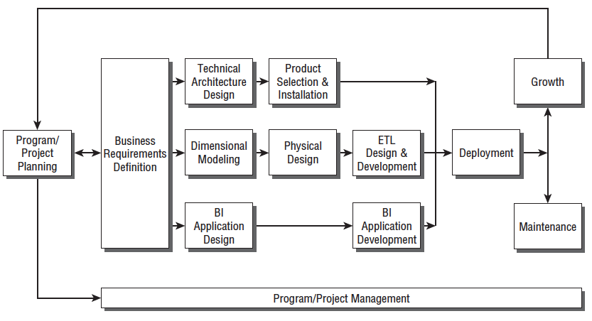

### Lifecycle Launch Activities <a name="launch"></a>

**Program/Project Planing and Management**
- Assessing Readiness
	- Have a strong executive business sponsor
	- Have a strong and compelling business motivition for tackling the DW/BI initiative
	- Assess feasibility (e.g. technical and resource feasibility, especially data feasibility - no short-term fix)
- Scoping and Justification
- Staffing
	- (Busiess) Business sponsor, Business driver, Business lead, Business users
	- (IT/Business) Business analyst, Data steward, BI application developer/designer
	- (IT) Project manager, Technical architect, Data architect/modeler, Database administrator, Metadata coordinator, ETL architect/designer, ETL developer
- Developing and Maintaining the Plan
- Business Requirements Definition
	- Requirements Preplanning
	- Collecting Business Requirements
	- Conducting Data-cCentric Interviews (acertain core data exist)
	- Documenting Requirement
	- Prioritizing Requirements (projects in the upper-left cell are meaningful opportunities)
	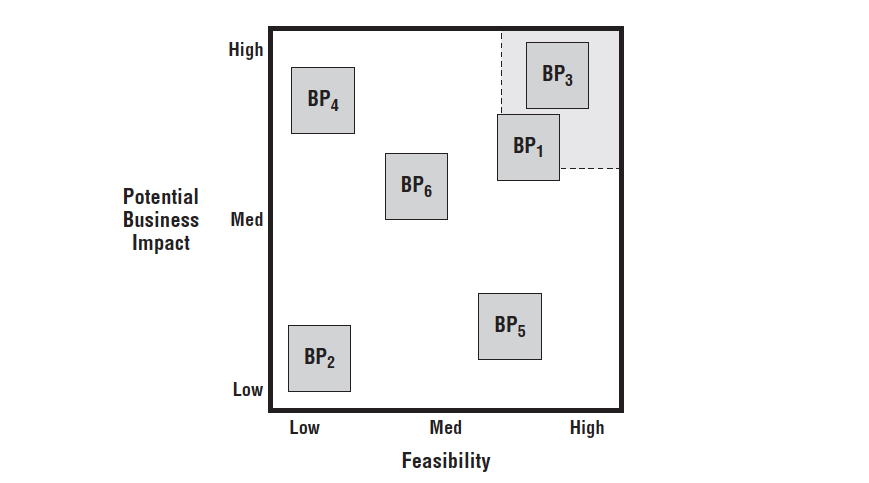

### Lifecycle Technology Track <a name="tech_track"></a>
**Technology Architecture Design**
- Estabilish an architecture task force of 2 or 3 people
- Collect architect-related requirements
- Document architect requiremnets
- Create the architecture model
- Determine architecture implementation phases
- Design and specify the subsystem
- Create the architecture plan
- Review and finalized the technical architecture <br/>

**Product Selection and Installation**
- Understand the corporate purchasing process
- Develop a product evaluating matrix
- Conduct market research
- Evaluate a short list of options
- (if necessary) Conduct a prototype
- Select product, install on trail, and negotiatie

### Lifecycle Data Track <a name="data_track"></a>
**Dimensional Modeling** <br/>

**Physical Design** <br/>
- Develop Naming and Database Standards
- Develop Initial Index Plan
- Design Aggregations, Includeing OLAP Database
- Finalize Physical Storage Detail <br/>

**ETL Design and Development**


### Lifecycle BI Application Track <a name="bi_track"></a>
- BI Application Specification
- BI Application Development

### Lifecycle Wrap-up Activities <a name="maintain"></a>
- Deployment
- Maintenance and Growth (Support, Education, Technical support, Program support)


---


## Chapter 18: Dimensional Modeling Process and Tasks <a name="chapter18"></a>

### Modeling Process Overview <a name="overview"></a>

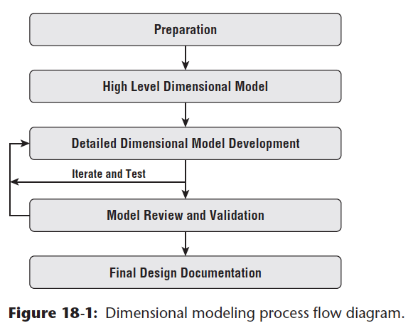

- Ceating a dimensional model is a highly iterative and dynamic process
- Complete high-level model
- Dive into the dimensional table with attribute definition, domain values, sources, relationships, data quality concerns, and transformations
- Model fact table
- Review and Validate with interested parties
- A typical design requires 3-4 weeks, but depends on team experience
> Goal: Create model that meets business requirement, verify data is available, and provide ETL team with a solid starting source-to-target mapping

### Get Organized <a name="organize"></a>
- Identify participants, especially business representatives
- Review the business Requirements
- Leverage a modeling tool
	- Spreadsheet as the initial documentation tool (easy to make changes)
	- Modeling tools to create dimensional models
- Leverage a data profiling tool
	- Verify data exist in a usable state
	- Manage data flaws
	- Understand how to convert it into dimensional model
	- Data profiling can be as simple as SQL statement, or as sophisticated as a special purpose tool
- Leverage/Establish naming convensions
	- The data labels must be descriptive and consistent from a business perspective
- Coordinate calendars and facilities
	- Several hours each day rather than the full day

### Design the Dimensional Model <a name="design_dim_model"></a>

**Design a dimensional model**
- identify business process
- declare the grain of the business process
- identify the dimensions
- identify the facts  <br/>

**Modeling work sequence**
- High-level model defining the model's scope and granularity

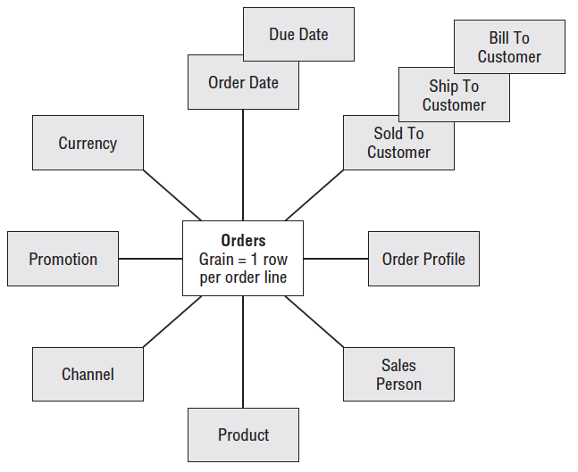

- Detailed design with table-by-table attributes and metrics
	- Identify dimensions and metrics
	- Identify the facts
	- Identify slowly changing dimension techniques 
		- Define how source data change be reflected in dimensional table
		- Figure out if a data element change is due to a source data correction
	- Document the detailed table designs
	- Track model issues in an issue log
	- Maintain updated bus matrix
	
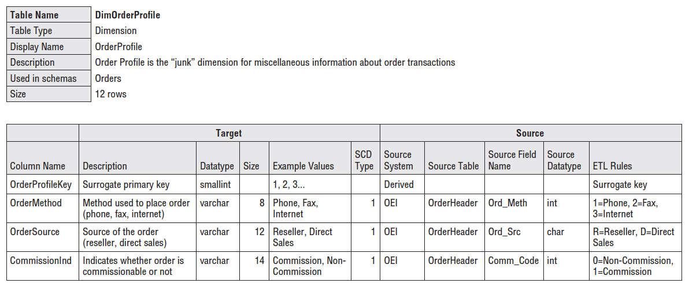

- Review and validate with IT and business representatives
	- IT review: bus matrix, dimension and fact details
	- Core user review (Business user with IT knowledge): similar to IT review
	- Broader business user review

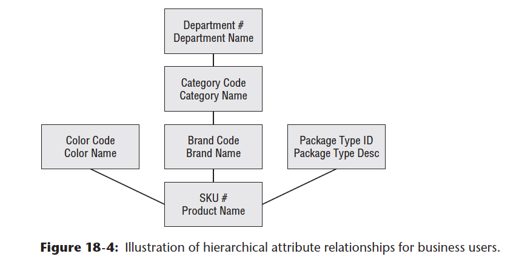

- Finalization of the design documentation
	- Brief description of the project
	- High-level data model diagram
	- Detailed dimensional design worksheet for each fact and dimensional table
	- Open issues
---


## Chapter 19: ETL Subsystems and Techniques <a name="chapter19"></a>

- Three Letter
	- E: get the data out of the original source location
	- T: do something to it
	- L: load it to a final set of tables for business users to query

### Round up the requirments
- **Business needs**
- **Compliance**: set some compliance restrictions to prove what they reported
- **Data Quality**: list the data elements whose quality is known to unacceptable, and list whether an agreement has been reached to correct the data before extraction. List all those in data profiling process.
- **Security**: data should be restricted to those who need to know(include physical backups)
- **Data Integration**: confirm dimensions & facts (metrics)
- **Data Latency**: how quickly the data can be delivered to business users
- **Archiving and Lineage**: stage the data after each major step of the ETL pipeline
- **BI delivery Interfaces**: List all facts, dimension tables, OLAP cubes and special database structures
- **Available Skills**: base on the skills that people can reach out
- **Legacy Licenses**


### The 34 Subsystems of ETL
- Extract
- Data cleaning and conforming
- Delivery
- Manage

### Extracting: getting data into the Data Warehouse
- Subsystem 1: Data Profiling
	- Before and during the ETL process
	- Squeeze out problems
- Subsystem 2: Change data Capture System
	- Isolating the latest source data is called **CDC**(change data capture).
	- Only update the data that has changes
	- Tag changed data with reason (update/correction)
	- Support complaince tracking with additional metadata
	- Tools: audit column, time extracts, full diff compare, database log scraping, message queue monitering 
- Subsystem 3: Extract System
	- Method to get data: file or stream
	- 

### Cleaning and Conforming Data
- Improving Data Quality Culture and Processes
- Subsystem 4: Data Cleaning System
- 


## Chapter 20: